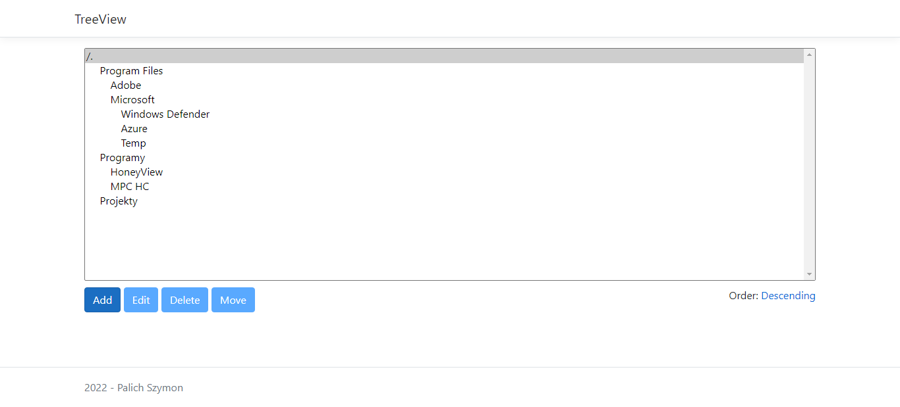

# TreeView-ASP-MVC
Lets you easily manage tree structure.
- Display structure
- Add new nodes
- Delete, edit or move existing nodes


## Technologies
- ASP.NET MVC 5
- MSSQL
- HTML, CSS, Bootstrap, Vue,js
- EntityFramework

## Endpoints
```
GET: 	/Tree/Index/ 				Get tree, ascending order
GET:	/Tree/Index/desc			Get tree, descending order

GET:	/Tree/Add/{id}				Add form
POST:	/Tree/Add				Create new node.
		Parameters:
			Name
			ParentId

GET:	/Tree/Delete/{id}			Delete confirmation form
POST:	/Tree/Delete/{id}			Deletes a node

GET:	/Tree/Edit/{id}				Edit form
POST:	/Tree/Edit/{id}				Updates node name.
		Parameters:
			Name

GET:	/Tree/Move/{id}				Move form
POST:	/Tree/Move/{id}				Moves node to new parent
		Parameters:
			ParentId
```

## Launching
1. Set connection string in `appsettings.json`
2. Apply migration (tree) via `update-database`


